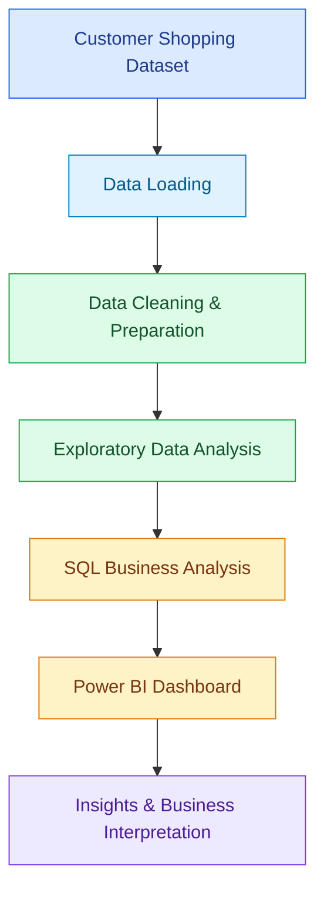

# 🛍️ Customer Shopping Behavior Analysis

### Turning Retail Data into Actionable Business Insights with Python, SQL & Power BI

<p align="center">
  
  
  
  
  
</p>

<p align="center">
  <b>An end-to-end data analytics project exploring customer purchasing behavior, identifying business trends, and transforming raw retail data into meaningful insights through Python, SQL, and Power BI.</b>
</p>

---

## 📌 Overview

Understanding customer behavior is essential for businesses to improve customer satisfaction, optimize pricing strategies, and make informed decisions.

This project analyzes customer shopping data through a structured data analytics workflow, starting with data preparation and exploratory analysis in Python, followed by SQL-based business analysis and interactive data visualization in Power BI.

The goal is to uncover patterns in customer spending, purchasing preferences, product performance, discounts, and customer segments, and present the findings in a format that supports data-driven decision-making.

## 🎯 Project Objectives

* Analyze customer purchasing patterns and shopping preferences.
* Identify customer segments and understand their spending behavior.
* Examine the relationship between discounts, purchases, and revenue.
* Evaluate product and category-level performance.
* Use SQL to answer business-oriented questions from structured data.
* Build an interactive Power BI dashboard to communicate key metrics and findings.
* Demonstrate an end-to-end data analytics workflow using industry-relevant tools.

## 🧰 Tech Stack

| Technology           | Purpose                                                          |
| -------------------- | ---------------------------------------------------------------- |
| **Python**           | Data processing, analysis, and exploration                       |
| **Pandas**           | Data manipulation, cleaning, and transformation                  |
| **NumPy**            | Numerical operations                                             |
| **Jupyter Notebook** | Interactive analysis and documentation                           |
| **SQL**              | Business queries, aggregations, segmentation, and trend analysis |
| **Power BI**         | Interactive dashboards and data visualization                    |
| **Git & GitHub**     | Version control and project management                           |

## 🔄 Project Workflow



### 1. Data Loading & Preparation — Python

The customer shopping dataset is loaded into Python for initial inspection and preparation.

Key activities:

* Loaded and inspected the dataset using Pandas.
* Examined data types, column structure, and missing values.
* Prepared structured data for further analysis.
* Explored relevant customer, product, purchase, and transaction attributes.

### 2. Exploratory Data Analysis — Python

Exploratory Data Analysis (EDA) is used to understand the dataset, uncover patterns, and identify relationships among relevant variables.

Areas explored include:

* Customer purchasing behavior.
* Spending patterns and purchase amounts.
* Product and category preferences.
* Customer demographics and segmentation.
* Discounts and other purchase-related attributes.

### 3. Business Analysis — SQL

SQL is used to perform structured analysis and answer business-focused questions.

The project demonstrates:

* **Aggregations:** Summarizing purchasing and revenue-related metrics.
* **Joins and subqueries:** Structuring data analysis where applicable.
* **CTEs:** Organizing complex queries into readable, reusable steps.
* **CASE statements:** Categorizing customers and transactions based on conditions.
* **Window functions:** Ranking and comparing products within categories.
* **Customer segmentation:** Exploring differences in purchasing and spending behavior.

These queries help translate raw records into information that is easier to interpret from a business perspective.

### 4. Interactive Dashboard — Power BI

Power BI is used to present customer shopping patterns and business metrics in a visual and interactive format.

The dashboard is designed to help users explore:

* Customer purchasing behavior.
* Spending and revenue-related metrics.
* Product and category performance.
* Customer segments and preferences.
* Shopping trends and comparisons.

> **Dashboard Preview:** Add a screenshot of your actual Power BI dashboard here once you have exported it.

<!-- Replace the path below with your actual screenshot file -->

<!--  -->

## 📊 Key Business Questions

This project explores questions such as:

1. How do purchasing patterns differ across customer segments?
2. Which product categories contribute to customer spending?
3. How are discounts associated with customer purchases?
4. What differences exist between customer groups based on their shopping preferences?
5. How can customer behavior data be used to support business decisions?
6. Which products rank highly within their respective categories?

## 💡 Business Applications

The analysis can help retail businesses:

* **Customer Segmentation:** Understand customer groups with different purchasing patterns.
* **Pricing & Discounts:** Explore how discount usage relates to spending and purchasing behavior.
* **Product Strategy:** Identify product and category-level patterns to support merchandising decisions.
* **Customer Engagement:** Use behavioral insights to inform targeted customer engagement.
* **Data-Driven Planning:** Monitor relevant metrics and support business planning through visual reports.

These are potential applications of the analysis, not claims that the project has measured or proven specific business improvements.

## 🗂️ Repository Structure

```text
customer-behavior-analysis/
│
├── customer_behavior_analysis.ipynb   # Python analysis and EDA
├── customer_behavior_sql.sql          # SQL business analysis
├── customer_behavior_dashboard.pbix    # Power BI dashboard
├── customer_shopping_behavior.csv      # Dataset (if included)
│
└── README.md                            # Project documentation
```

*Note: Update the filenames above to match the exact names in your repository.*

## 🚀 Getting Started

### Prerequisites

Make sure you have the following installed:

* Python 3.9+
* Jupyter Notebook
* Pandas
* NumPy
* A SQL-compatible database or SQL environment suitable for the provided queries
* Microsoft Power BI Desktop

### Installation

**1. Clone the repository**

```bash
git clone https://github.com/nikshith-y/customer-behavior-analysis.git
```

**2. Navigate to the project directory**

```bash
cd customer-behavior-analysis
```

**3. Install the Python dependencies**

```bash
pip install pandas numpy matplotlib seaborn jupyter
```

**4. Launch Jupyter Notebook**

```bash
jupyter notebook
```

Open the analysis notebook and execute the cells to explore the data and analysis.

**5. Run the SQL analysis**

Open the SQL script in your compatible SQL environment, configure the dataset or table according to the script, and execute the queries.

**6. Explore the Power BI dashboard**

Open the `.pbix` file using Power BI Desktop. If prompted, configure the data source to match your local dataset location.

## 📈 Results & Insights

The project provides an analytical view of customer shopping behavior through data exploration, SQL analysis, and interactive visualization.

The analysis is intended to help identify:

* Variations in customer spending and purchasing behavior.
* Differences in product and category performance.
* Customer segments with distinct shopping preferences.
* Patterns involving discounts and purchase decisions.

**Add your verified findings here** after reviewing the notebook and dashboard. For example, include a specific customer segment's average spending, a category's share of revenue, or a verified discount-related observation. Including real figures and their calculation method will make this section substantially more valuable.

## 🔮 Future Enhancements

* Add customer cohort and retention analysis.
* Develop customer lifetime value (CLV) analysis.
* Build customer segmentation models using machine learning.
* Incorporate time-based purchasing trend analysis if suitable date data is available.
* Automate data refresh and dashboard updates.
* Extend the dashboard with additional drill-through analysis and KPI monitoring.

## 🎓 Skills Demonstrated

* Data Cleaning and Transformation
* Exploratory Data Analysis (EDA)
* Python for Data Analytics
* Pandas and NumPy
* SQL Query Development
* CTEs, Subqueries, and Window Functions
* Customer Segmentation
* Business-Oriented Data Analysis
* Power BI Dashboard Development
* Data Visualization and Communication

## 👨‍💻 Author
**Nikshith Yekkaladevi**

* **GitHub:** [nikshith-y](https://github.com/nikshith-y)
* **LinkedIn:** [nikshith-y](https://linkedin.com/in/nikshith-y)
* **Email:** [nikshith.y5@gmail.com](mailto:nikshith.y5@gmail.com)

---

<p align="center">
  <b>Turning data into insights, and insights into informed decisions.</b>
</p>
